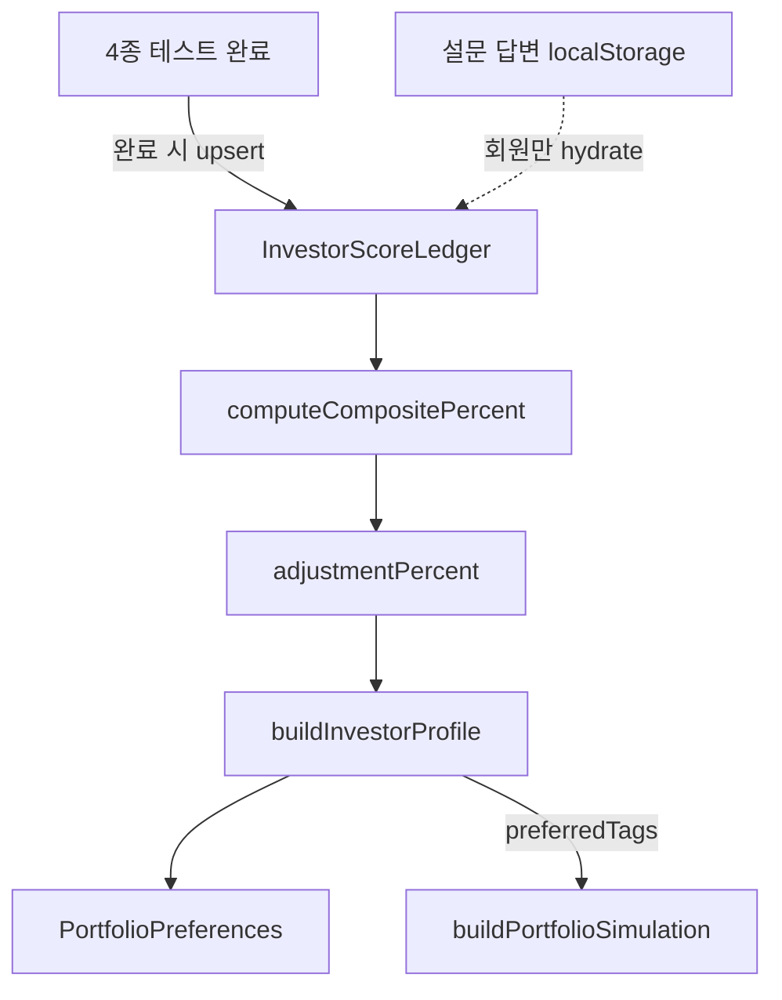

# 투자 성향 프로필 · 추천 시스템

테스트별 점수(ledger) → 가중 합산(composite) → 조절 슬라이더(adjustment) → 투자 유형·태그 → 포트폴리오 시뮬레이션 추천 순위에 반영하는 기능입니다.

---

## 개요

| 항목 | 설명 |
|------|------|
| 테스트 4종 | 종합(`investor-type`), 미니 3종(`risk-check`, `horizon-goal`, `allocation-style`) |
| 점수 ledger | 테스트마다 1슬롯, **같은 testId 재완료 → 갱신**, 다른 testId → 누적 |
| composite | 완료된 테스트만 가중 평균 (종합 40%, 미니 각 20%) |
| adjustment | 내 정보에서 70~130% 슬라이더 (ledger는 변경하지 않음) |
| 추천 | `preferredTags`로 `rankRecommendationsByTags` → simulation pick 순서 조정 |

---

## 화면 · 경로

| 경로 | 역할 |
|------|------|
| `/guide/investor-type` | 10단계 종합 투자 유형 진단 |
| `/guide/analysis/risk-check` 등 | 미니 분석 3종 |
| `/guide?category=type-analysis` | Tip 「나의 유형분석」 카테고리 |
| `/my-info#investor-profile` | 프로필 점수·조절·목표 비중 UI |

---

## 데이터 흐름



---

## 저장소 (게스트 vs 회원)

### 비회원

| 데이터 | 저장 위치 | 수명 | 비고 |
|--------|-----------|------|------|
| **프로필 ledger + adjustment** | `sessionStorage` (`sar_guest_data.investorProfile`) | 탭/세션 | 점수·조절값 |
| **포트폴리오 목표 비중** | `sessionStorage` (`sar_guest_data.portfolioPreference`) | 탭/세션 | KR/US/maxSingle |
| **설문 답변 초안** | `localStorage` (`sar_investor_survey`, `sar_mini_analysis_*`) | 브라우저 영구 | **회원/비회원 공용** |

**중요**: 비회원 프로필은 **localStorage 답변을 ledger에 자동 반영하지 않습니다.**  
(같은 브라우저에 예전 설문이 남아 있어도, 이번 비회원 세션에서 테스트를 완료하기 전까지 my-info 프로필 점수는 0/4입니다.)

가이드 설문 페이지는 localStorage를 읽어 “이전에 풀었던 결과” 화면을 보여줄 수 있습니다. 프로필 점수와는 별개입니다.

### 회원

| 데이터 | 저장 위치 |
|--------|-----------|
| ledger + adjustment + 목표 비중 | DB `PortfolioPreference.investorProfile` (JSON) + `targetKrPercent` 등 |
| 설문 답변 초안 | localStorage (동일 키) |
| DB profile 없을 때 | localStorage 완료 답변 → **hydrate-on-read**로 ledger 복원 |

### 게스트 → 회원 전환

1. 게스트 상태에서 `login` / `register` / OAuth 시작 시 **`transferProfileAndClear()`** — profile 스냅샷 → `sar_pending_investor_profile`
2. 게스트 **로그아웃** · **loginAsGuest** 시 pending **삭제** (타 계정 승계 방지)
3. 회원 첫 preferences 로드 시 DB profile null이면 pending 1회 승계 (PUT **성공 후** take)

---

## 점수 모델

### percentScore (min-max 정규화)

```typescript
percentScore = ((rawScore - minScore) / (maxScore - minScore)) * 100
```

- 종합: min=10, max=40 → 0~100%
- 미니(5문항): min=5, max=20 → 0~100%

`rawScore / maxScore`가 아님 — 보수적 최저점도 0%로 매핑.

### composite (가중 재정규화)

완료된 테스트의 weight만 합산:

| testId | weight |
|--------|--------|
| `investor-type` | 40% |
| `risk-check` | 20% |
| `horizon-goal` | 20% |
| `allocation-style` | 20% |

예: 종합만 완료 → composite = 해당 테스트 percentScore.

### effectivePercent → 유형

```typescript
effectivePercent = compositePercent * adjustmentPercent / 100  // composite null → balanced 기본
totalScore = 10 + (effectivePercent / 100) * 30              // 10~40
typeId = resolveInvestorTypeFromScore(totalScore)
```

### 영속 vs 파생

DB/세션에 저장: **`ledger` + `adjustmentPercent` + `updatedAt`만**  
`compositePercent`, `typeId`, `preferredTags` 등은 `buildInvestorProfile()`로 **읽을 때마다 계산**.

---

## 추천 (시뮬레이션)

`GetPortfolioSimulationUseCase` / `GuestPortfolioCapitalRepository`:

1. `buildInvestorProfile(storedProfile)`
2. `rankRecommendationsByTags(recommendations, profile.preferredTags)`
3. `buildPortfolioSimulation({ recommendations: ranked, ... })`

**fallback**: 선호 tag와 일치하는 종목이 0건이면 **원래 추천 순서 유지** (add 액션 공백 방지).

시뮬레이션은 market gap 기준 **최대 2종목 add** — tag rank는 pick 품질 개선용.

---

## API · DB

### Prisma

`PortfolioPreference.investorProfile Json?`  
Migration: `apps/web/prisma/migrations/20260724120000_add_investor_profile/migration.sql`

```bash
cd apps/web
npx prisma migrate deploy   # 프로덕션
# 또는
npx prisma db push          # 로컬
```

### PUT `/api/portfolio/preferences`

Body (기존 3필드 + optional):

```json
{
  "targetKrPercent": 70,
  "targetUsPercent": 30,
  "maxSingleWeightPercent": 40,
  "investorProfile": {
    "ledger": { "entries": {} },
    "adjustmentPercent": 100,
    "updatedAt": "2026-08-01T00:00:00.000Z"
  }
}
```

- `investorProfile` 생략 시 기존 JSON 유지 (merge)
- GET 응답에 `investorProfile` 포함

### GET `/api/portfolio/simulation`

응답에 `investorProfile` (BuiltInvestorProfile, 파생 필드 포함) 추가.

---

## 소스 파일

### @sar/shared

| 파일 | 역할 |
|------|------|
| `packages/shared/src/investor-survey/profile.ts` | ledger, composite, buildInvestorProfile, rankRecommendationsByTags |
| `packages/shared/src/investor-survey/catalog.ts` | 10유형, resolveInvestorTypeFromScore |
| `packages/shared/src/investor-survey/analysis-tests.ts` | 미니 3종 정의 |

테스트: `test/shared/investor-profile.spec.ts`

### apps/web

| 파일 | 역할 |
|------|------|
| `client/data/investor-profile-hydrate.ts` | localStorage → ledger hydrate (회원 전용) |
| `client/data/guest/guest-storage.ts` | `investorProfile` sessionStorage |
| `client/data/guest/pending-investor-profile.ts` | 게스트→회원 1회 승계 |
| `presentation/hooks/useInvestorProfile.ts` | 통합 훅 (load/save/upsert/adjustment) |
| `presentation/features/investor-profile/InvestorProfileSection.tsx` | my-info UI |
| `presentation/features/investor-survey/*` | 설문·결과 (완료 시 ledger auto-upsert) |
| `server/domain/usecases/portfolio/portfolio-capital.use-cases.ts` | simulation tag rank |
| `app/api/portfolio/preferences/route.ts` | investorProfile merge PUT |

### i18n

- `apps/web/src/i18n/locales/investor-profile.ko.json` / `.en.json`
- `investor-survey.*` — ledger 토스트, goProfile 링크

---

## UX 동작

| 이벤트 | 동작 |
|--------|------|
| 설문/미니 **완료** | ledger upsert + preferences 자동 저장 + 토스트 (갱신/누적) — **이번 세션에서 마지막 단계 완료 시에만** (`sessionCompleted`) |
| my-info **조절 슬라이더** | adjustmentPercent만 변경, ledger 유지 |
| my-info **KR/US/maxSingle 저장** | preferences PUT (회원) / guest store (비회원) |
| composite **null** (0/4) | balanced 기본 유형, 조절 슬라이더 비활성 |
| 「포트폴리오 목표에 반영」 버튼 | **제거** — 완료 시 자동 반영 |

---

## 알려진 trade-off

1. **차원 중복**: 종합 10문항과 미니가 같은 `stepId` 재사용 — UI에 슬롯별 가중치(40%/20%) 표시로 설명.
2. **설문 localStorage 공용**: 비회원/회원·브라우저 단위 공유. 프로필 점수와 분리됨(비회원).
3. **추천 영향 범위**: simulation add 최대 2종 — 전체 포트폴리오 재편 아님.

---

## 구현 상태

| 항목 | 상태 |
|------|------|
| Shared profile + tests | ✅ |
| Guest sessionStorage + member DB/API | ✅ |
| useInvestorProfile + hydrate (회원만) | ✅ |
| InvestorProfileSection (my-info) | ✅ |
| Simulation tag rank + fallback | ✅ |
| 설문 결과 auto-apply + i18n | ✅ |
| Prisma migration SQL | ✅ (배포 시 migrate 필요) |

검수 계획 6건 (percent 정규화, hydrate 분리, guest→member, API merge, derived-only-on-read, rank fallback) 반영 완료.
